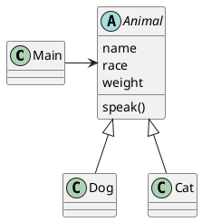

# Polymorphism
関数ポインタを使うことで実現します。

## 実装するクラスの関係


## Animalクラス

Animal.h
```c
#ifndef ANIMAL_H_
#define ANIMAL_H_

#ifdef __cplusplus
extern "C" {
#endif // __cplusplus

typedef struct _Animal Animal;

struct _Animal {
  char name[64];
  char race[64];
  double weight;
  void (*speak)(Animal* this);
};

void Animal_construct(Animal* const this, char* const name, char* const race, double const weight);

void Animal_speak(Animal* this);


#ifdef __cplusplus
}
#endif // __cplusplus

#endif // ANIMAL_H_
```

animal.c
```c
#include <string.h>

#include "animal.h"


void Animal_construct(Animal* const this, char* const name, char* const race, double const weight) {
  strcpy(this->name, name);
  strcpy(this->race, race);
  this->weight = weight;
}

void Animal_speak(Animal* this) {
  this->speak(this); // speakの実装は具象クラスに任せ、Animalクラスからは実装されたメソッドを呼び出すだけ。
}

```

## Dogクラス
dog.h
```c
#ifndef DOG_H_
#define DOG_H_

#include <stdio.h>

#include "animal.h"


#ifdef __cplusplus
extern "C" {
#endif // __cplusplus

typedef struct _Dog {
  Animal base;
} Dog;

void Dog_construct(Dog* const this, char* const name, char* const race, double const weight);

void Dog_speak(Animal* const this);

#ifdef __cplusplus
extern }
#endif // __cplusplus

#endif // DOG_H_

```

dog.c
```c
#include <stdio.h>

#include "dog.h"

void Dog_construct(Dog* const this, char* const name, char* const race, double const weight) {
  Animal_construct((Animal*)this, name, race, weight);
  this->base.speak = Dog_speak; // 抽象クラスのメソッドにDogクラスで実装したメソッドを対応付ける
}

void Dog_speak(Animal* const this) {
  printf("わんわん\n");
}

```

## Catクラス
```c
#ifndef CAT_H_
#define CAT_H_

#include <stdio.h>

#include "animal.h"


#ifdef __cplusplus
extern "C" {
#endif // __cplusplus

typedef struct _Cat {
  Animal base;
} Cat;

void Cat_construct(Cat* const this, char* const name, char* const race, double const weight);

void Cat_speak(Animal* const this);

#ifdef __cplusplus
extern }
#endif // __cplusplus

#endif // CAT_H_

```

cat.c
```c
#include <stdio.h>

#include "cat.h"

void Cat_construct(Cat* const this, char* const name, char* const race, double const weight) {
  Animal_construct((Animal*)this, name, race, weight);
  this->base.speak = Cat_speak;　// 抽象クラスのメソッドにCatクラスで実装したメソッドを対応付ける
}

void Cat_speak(Animal* const this) {
  printf("にゃーにゃー\n");
}

```

## main
```c
#include <stdio.h>
#include <stddef.h>

#include "animal.h"
#include "cat.h"
#include "dog.h"

int main(void) {
  Dog pochi;
  Dog_construct(&pochi, "ポチ", "柴", 10.3);

  Cat tama;
  Cat_construct(&tama, "タマ", "アメリカンショートヘア", 8.5);

  Animal* animals[] = {(Animal*)&pochi, (Animal*)&tama};

  for(size_t i=0; i < sizeof(animals) / sizeof(animals[0]); i++) {
    Animal_speak(animals[i]); // DogクラスかCatクラスかを気にすることなくAnimal_speakを呼び出せばよい
  }

  return 0;
}

```